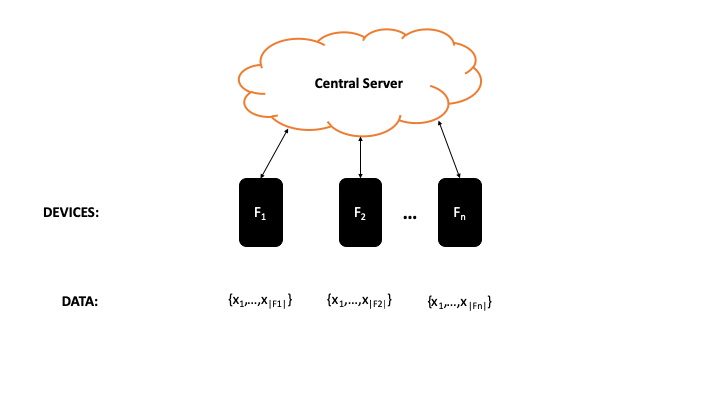

# Distributed Optimization for Machine Learning

### What's in the repo

+ `notes`: folder containing notes on the selected papers (short descriptions will be provided below)

# Federated Learning

Federated Learning (FL) is a distributed optimization framework. We care about the following type of FL architecture:

In this _centralized_ structure, we have the following update rules:

* Assume we are at time step $t$
1. The Central Server (CS) will send out model update $w_t$ to devices $F_1,\dots,F_n$
1. Devices $F_1,\dots,F_n$ will use their data $\{x_1,\dots,x_{|F_i|}\}$ to update their local models $w_{t+k}^i$, for $i=1,\dots,n$, for $k=1,\dots,K$ iterations
1. Each device will send their local model updates to the CS which will aggregate the updates to produce $w_{t+K}$ and the process will repeat

##### Key concerns

1. **IF** the data needs to be protected (i.e. privacy is of importance), should we use _differential privacy_ methods when sending/receiving data from the CS?
1. Can the updates happen _asynchronously_? How important is the number of local update iterations between aggregation?
1. How to handle devices that drop in and out of computations? Is imposing a schedule feasible?

# Papers

**Bhagoji, Arjun, et. al. "[Analyzing Federated Learning through an Adversarial Lens](http://proceedings.mlr.press/v97/bhagoji19a.html)." 2019.**

> The researchers in this paper consider the possibility of an adversarial node in the FL setting. They discuss the adversary's goal to perform model poisoning, which leads to targeted misclassification for their case studies.

**Li, Tian, et. al. "[Federated Learning: Challenges, Methods, and Future Directions](https://arxiv.org/abs/1908.07873)." 2019.**

> This provides a brief overview of FL and some potential research directions.

**Li, Xiang, et. al. "[On the Convergence of FedAvg on Non-IID Data](https://arxiv.org/abs/1907.02189)." 2019.**

> The researchers in this paper provide a convergence proof for the Federated Averaging algorithm when the data on each device is not drawn from the same data distribution. [Here is a link to my notes on the paper](notes/LiXiang2019/LiXiang2019.md).

**Mahloujifar, Saeed, et. al. "[Universal Multi-Party Poisoning Attacks](http://proceedings.mlr.press/v97/mahloujifar19a/mahloujifar19a.pdf)." 2019.**

> The researchers in this paper focus on proving that any multi-agent system is susceptible to corruptions. [Here is a link to my notes on the paper](notes/Mahloujifar2019/Mahloujifar2019.md).

**Yang, Qiang, et. al. "[Federated Machine Learning: Concept and Applications](https://arxiv.org/abs/1902.04885)." 2019.**

> The researchers in this paper explain the basic concept of Federated Learning: including the architectures and issues that need to be addressed. [Here is a link to my notes on the paper](notes/Yang2019/Yang2019.md).
