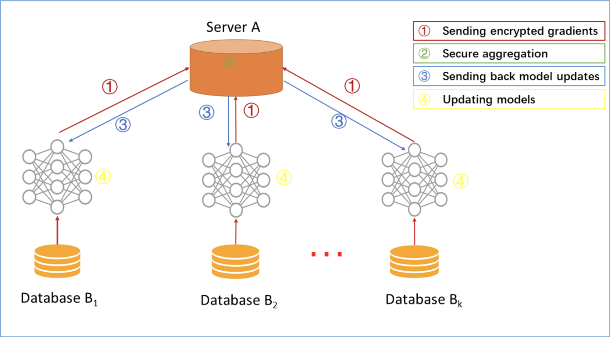
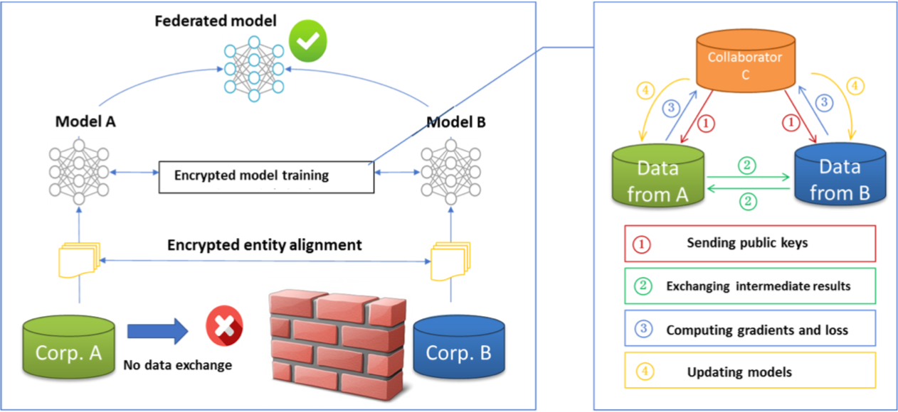

# [Federated Machine Learning: Concept and Applications](https://arxiv.org/abs/1902.04885)

**Authors:** Qiang Yang, Yang Liu, Tianjian Chen, Yongxin Tong

## Summary

The researchers above focus on describing multiple types of Federated Learning architectures and the security risks/assumptions typically associated with these architectures.

### Federated Learning

The basic idea of Federated Learning (FL) is that we want to train a machine learning model (i.e. Logistic regression, neural network, etc.) using data that is stored on multiple devices (i.e. cell phones, personal computers, etc.). A natural (read: "conventional") method to accomplish this would be to combine all of the data together and train a model using all of the data. Mathematically, this looks like: given $n$ "devices" (generically used to describe where the data is stored) denoted as $\{F_1,\dots,F_n\}$, with respective data $\{d_1,\dots,d_n\}$, we would train a model using $d=\bigcup\limits_{i=1}^nd_i.$ With FL, we want to avoid device $j$ having access to device $i$'s data for all $i\ne j$; thus the conventional training method is not desirable and we seek a new way for our devices to communicate with one another.

This paper is concerned with describing two things:

* How can we accomplish this communication?
* How can we ensure only the _necessary_ data is shared (i.e. ensure privacy)?

### Federated Learning Categories

This section is concerned with describing the different ways for multiple devices to share their information. All pictures are from the paper.

##### Horizontal Federated Learning

In this FL setting, we are assuming homogeneity in the _features_ of the data on each device, but each device has a different subset of the data (i.e. all devices have user information, but each device has different users). The training process can be summarized by completing the following steps:

1. Each device locally computes training information (i.e. gradients, Hessians, etc.) and sends an encrypted version of the gradients to a central server.
2. The central server aggregates the data.
3. The server sends the updated aggregate results to the devices.
4. Each device decrypts the aggregate results and updates their own model.

##### Vertical Federated Learning

In this FL setting, we are assuming that the feature spaces are different across devices (i.e. each device contains pieces of the user's data) and that the devices can only communicate through a third party, for security purposes. The training process can be summarized by completing the following steps:

1. The third party sends encryption information to the devices (i.e. public key).
2. The devices encrypt and exchange their information (i.e. gradients, etc.)

**I have questions: if A and B can already exchange information, why do we need C?**

##### Federated Transfer Learning

In this FL setting, we are assuming the same architecture as in Vertical FL, but we apply **transfer learning:**

> Transfer learning is the process of gaining knowledge of solving one problem and applying that knowledge to a similar, but different problem

So we assume that our data does not overlap (i.e. each device has different users), but we need to solve a supervised learning problem on one device so we use the other devices to come up with a good representation for the sample space.

### Privacy of Federated Learning

This section is concerned with describing a few security protocols that FL uses. The background required to fully understand these topics lies in the field of cryptography. Definitely need more time to understand these.

##### Secure Multi-party Computation (SMC)

##### Differential Privacy

##### Homomorphic Encryption
